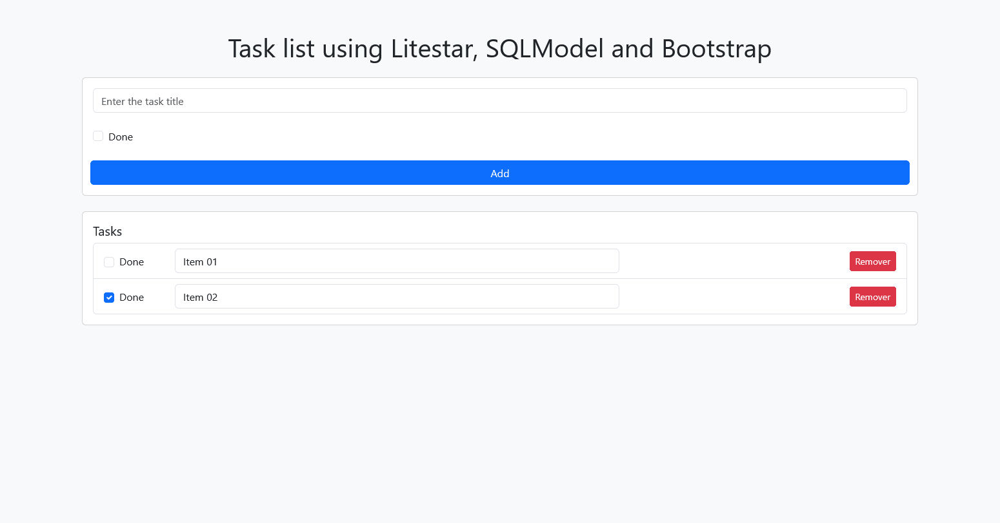

# Litestar - SQLModel - Alembic



[](https://github.com/natorsc/py-litestar)
[](https://github.com/natorsc/py-litestar)
[](https://github.com/natorsc/py-litestar)
[](./LICENSE)

## ✨ Sobre este projeto

Um modelo inicial pronto para uso para a criação de aplicativos web com o framework Litestar e o SQLModel.

> estruturado, organizado e fácil de ampliar.

## 🛠 Tecnologias utilizadas

[](https://www.python.org/)
[](https://github.com/litestar-org/litestar)
[](https://github.com/fastapi/sqlmodel)
[](https://github.com/sqlalchemy/alembic)
[](https://github.com/docker)
[](https://github.com/astral-sh/uv)

## 👨‍💻 Autor

Criado com 💙 por Renato Cruz. Tem alguma dúvida ou sugestão? Entre em contato a qualquer momento!

[](mailto:natorsc@gmail.com)

O que estou ouvindo enquanto programo ou estudo 😎🎵:

[](https://open.spotify.com/playlist/1xf3u29puXlnrWO7MsaHL5)

## 💡 Extra

Executar o projeto:

```bash
uvicorn py_litestar.app:app --reload
```

Ou

```bash
uv run server
```

### Documentação interativa

- ReDoc: http://localhost:8000/schema.
- Swagger UI: http://localhost:8000/schema/swagger.
- Stoplight Elements: http://localhost:8000/schema/elements.
- RapiDoc: http://localhost:8000/schema/rapidoc.

### Alembic

Sempre que houver alterações na tabelas executar:

```bash
uv run alembic revision --autogenerate -m "texto_da_alteração"
```

Para aplicar a alteração:

```bash
uv run alembic upgrade head
```

> Novas tabelas (models) devem ser importadas em `migrations/env.py`.

#### Erros

```bash
sa.Column('title', sqlmodel.sql.sqltypes.AutoString(length=255), nullable=False),
                   ^^^^^^^^
NameError: name 'sqlmodel' is not defined
```

Adicionar `import sqlmodel.sql.sqltypes  # noqa: F401` no arquivo de migração que foi gerado.
